# Yappr product roadmap

Living document. Horizons are **themes and outcomes**, not fixed dates. Revisit after each release.

## Product intent

**Yappr** is a **local-first** voice + chat assistant for technical users: terminal TUI and SDK, local **Kokoro / Whisper** via Python, **Ollama** (and optional **OpenRouter**) for chat, **MCP** tools from user config.

**Primary wedge (recommended):** power users who already run **Ollama** and often **Cursor MCP** — voice and chat in one loop without shipping a second IDE.

### Roadmap horizons (sequencing)

Relative order: each horizon **builds on** the previous; Horizon 4 is optional and only if you pursue paid or org tiers.

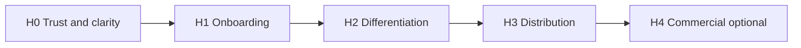

### System context (what the product connects)

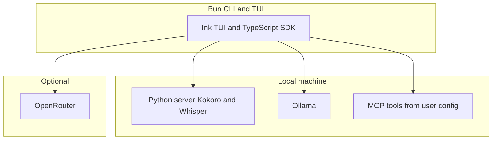

### Wedge and trust (mind map)

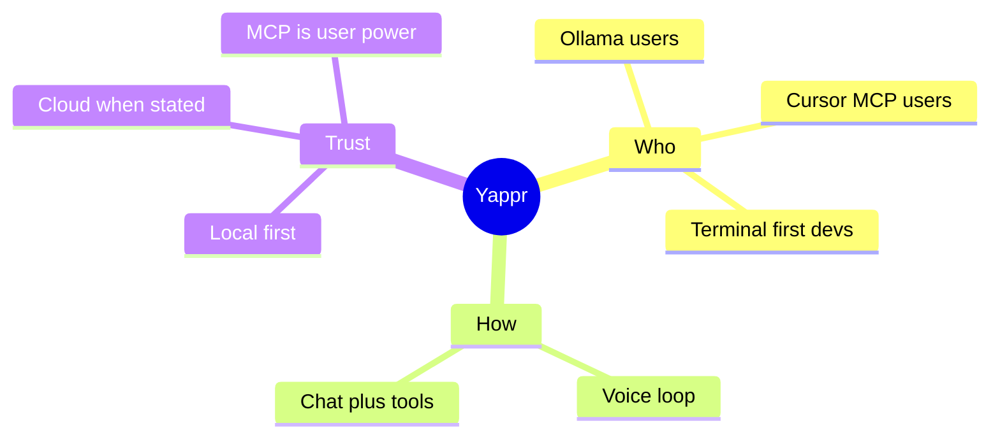

---

## Horizon 0 — Trust and clarity (ship before “launch”)

These are not flashy features; they prevent wrong users and bad press.

| Outcome                   | Notes                                                                                                                         |
| ------------------------- | ----------------------------------------------------------------------------------------------------------------------------- |
| **Honest positioning**    | README and site: **local by default**; **optional OpenRouter** (cloud); **MCP = user-defined power** (not a sandbox).         |
| **First-run path**        | Single doc: install → Python server → `bun run tui` → first text chat → first voice; common failures (ports, ffmpeg, models). |
| **Repo hygiene**          | ~~Real clone URL; remove placeholder `yourusername`~~ (done 2026-05-12); link to issues/discussions if OSS.                   |
| **Threat model (1 page)** | Loopback defaults, LAN bind warning, where keys live (`settings.json`), MCP trust boundary.                                   |

**Exit criteria:** a new user on macOS + Apple Silicon can follow one path without reading the whole repo.

### Horizon 0 outcomes (what “done” unlocks)

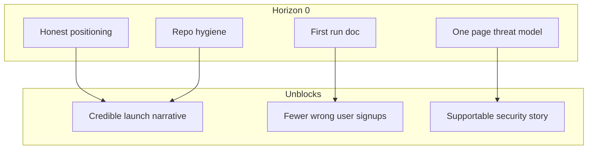

### Target first-run journey (after H0 plus H1 work)

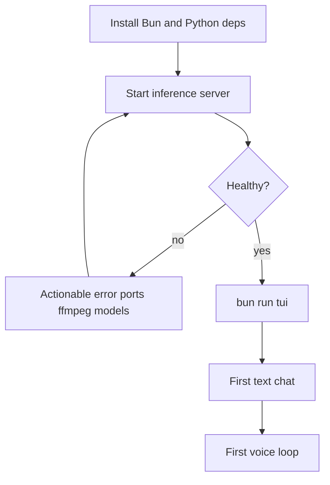

---

## Horizon 1 — Onboarding and reliability

| Theme                     | Examples                                                                                                                                                                                                                                                         |
| ------------------------- | ---------------------------------------------------------------------------------------------------------------------------------------------------------------------------------------------------------------------------------------------------------------- |
| **Installer / bootstrap** | Harden `setup.sh` (or replace with `bun run setup`); detect Bun/Python; optional model download progress.                                                                                                                                                        |
| **Health surfaces**       | TUI or CLI: inference server reachable, Ollama reachable, MCP config readable — actionable errors.                                                                                                                                                               |
| **Config UX**             | ~~Neutral default for MCP path~~ (done 2026-05-12: cascade `$YAPPR_MCP_CONFIG` → `~/.config/yappr/mcp.json` → `~/.cursor/mcp.json` in `packages/sdk/src/paths.ts`). Env overrides documented (`YAPPR_*` — `YAPPR_ALT_SCREEN`, `YAPPR_TEST`, `YAPPR_MCP_CONFIG`). |
| **Regression safety**     | CI already runs `lint` + `typecheck` + `bun test` and Python pytest on PRs (`.github/workflows/ci.yml`). **Remaining:** smoke for inference server boot + minimal audio-path test.                                                                               |

**Exit criteria:** support burden drops because failures are **visible and explained** in-product.

### In-product health checks (concept)

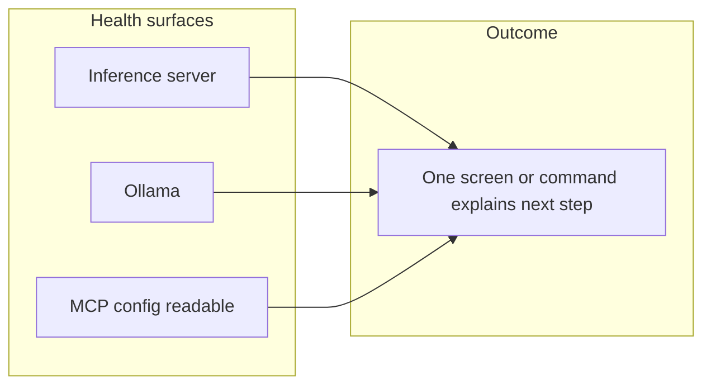

---

## Horizon 2 — Differentiation (why Yappr vs X)

| Theme                   | Examples                                                                                                      |
| ----------------------- | ------------------------------------------------------------------------------------------------------------- |
| **Voice loop polish**   | Latency perception, cancel/stop consistency, device switching without restart.                                |
| **Chat + tools**        | Predictable tool UX (status, errors); safe defaults for destructive MCP tools (document or optional confirm). |
| **Templates / recipes** | 2–3 shipped flows: e.g. “voice summarize selection,” “chat with repo context” — docs + short demo video.      |
| **SDK clarity**         | Minimal public API surface for embedders; examples in `examples/` or README section.                          |

**Exit criteria:** a 60-second demo shows something **hard to replicate** with generic ChatGPT + separate Whisper UI.

### Differentiation stack

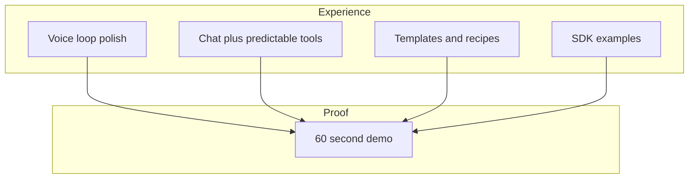

---

## Horizon 3 — Distribution and growth

| Theme                | Examples                                                                                                                   |
| -------------------- | -------------------------------------------------------------------------------------------------------------------------- |
| **Install channels** | `brew tap` formula or install script; optional **npm**/`bunx` publish for CLI name only (if aligned with Bun-first story). |
| **Packaging**        | Signed macOS binary or `.app` is expensive; start with **documented tarball + PATH**.                                      |
| **Discoverability**  | Comparison table (local vs OpenRouter); “when to use Yappr” section; showcase MCP + voice.                                 |

**Exit criteria:** install does not require `git clone` for casual triers.

### Distribution funnel (concept)

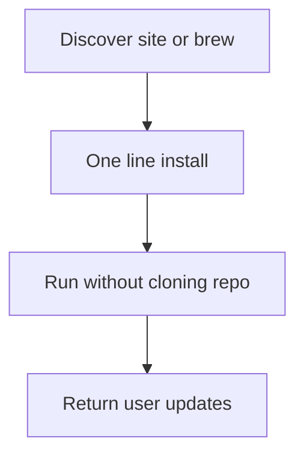

---

## Horizon 4 — Commercial or team-ready (optional)

Only if you choose paid or org tiers.

| Theme               | Examples                                                        |
| ------------------- | --------------------------------------------------------------- |
| **Secrets**         | Optional OS keychain for OpenRouter key; never log keys.        |
| **Telemetry**       | Opt-in crash or usage stats; documented and off by default.     |
| **Policy**          | SBOM / Dependabot; security contact; versioning semver for CLI. |
| **Windows / Linux** | Parity matrix; CI on multiple OSes for TUI + audio.             |

**Exit criteria:** a security questionnaire gets **short, honest answers** without hand-waving.

### Horizon 4 decision (optional path)

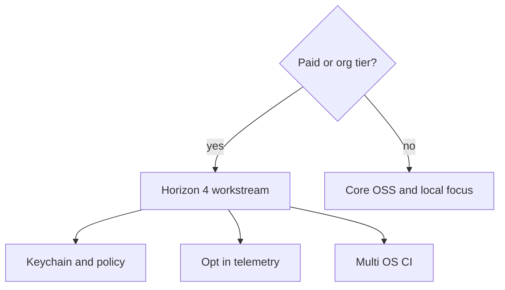

---

## Explicit non-goals (for now)

- Replacing **Cursor** or **full IDE** features.
- **Hosted** multi-tenant SaaS for chat (different product).
- **Consumer** “install from App Store for grandma” unless Horizon 3–4 is funded.

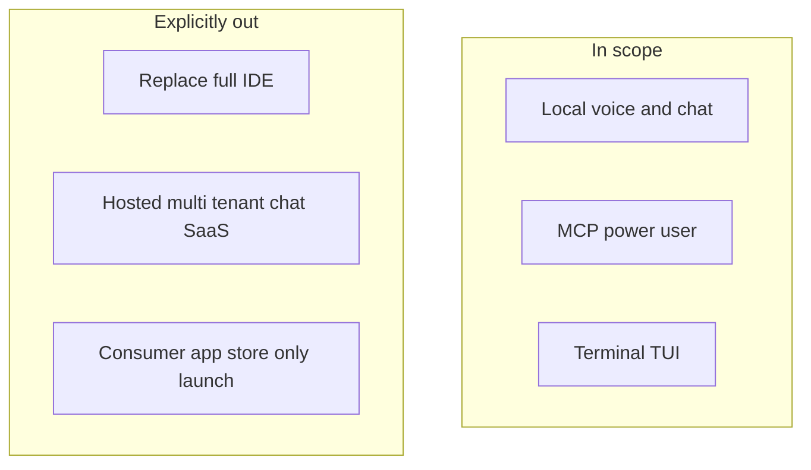

---

## How to use this doc

1. Pick **one horizon** for the next milestone release.
2. Turn rows into **issues** with acceptance criteria.
3. After release, update **Exit criteria** based on what actually shipped.

### Operating loop (roadmap to milestones)

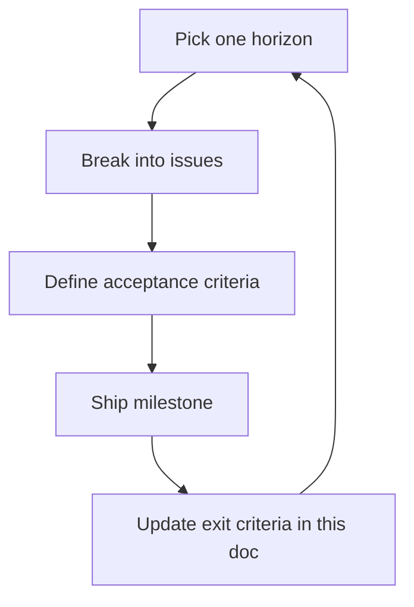

---

## Revision log

| Date       | Change                                                                                                                                                                                                                                                                                                                                                                                                  |
| ---------- | ------------------------------------------------------------------------------------------------------------------------------------------------------------------------------------------------------------------------------------------------------------------------------------------------------------------------------------------------------------------------------------------------------- |
| 2026-05-11 | Initial roadmap from product assessment and repo state.                                                                                                                                                                                                                                                                                                                                                 |
| 2026-05-11 | Added Mermaid diagrams: horizons, architecture, wedge mind map, H0–H4 visuals, non-goals, operating loop.                                                                                                                                                                                                                                                                                               |
| 2026-05-12 | Validation pass: marked clone-URL hygiene done; scoped H1 regression-safety to what's missing (CI already runs lint/typecheck/tests); annotated MCP config UX with current hardcoded paths and existing `YAPPR_*` vars.                                                                                                                                                                                 |
| 2026-05-12 | H1 MCP config UX shipped: neutral default `~/.config/yappr/mcp.json` with Cursor preset auto-discovery and `$YAPPR_MCP_CONFIG` override (`packages/sdk/src/paths.ts`). README, AGENTS, settings placeholder updated.                                                                                                                                                                                    |
| 2026-05-12 | Monorepo migration: split into Bun workspaces — `apps/cli` (was `src/cli`), `packages/sdk` (was `src/sdk`), `packages/lib` (was `src/lib`), `apps/desktop` (new Electrobun spike). Intra-package `~/*` aliases retained per-package; cross-package imports use `@yappr/sdk` / `@yappr/lib`. Root forwards `tui`/`speak`/`chat`/`voices`/`dev`/`desktop` via `bun --filter`.                             |
| 2026-05-12 | Electrobun desktop Phase 0 scaffold: `apps/desktop` with React 19 + Tailwind + Vite + `@styled-cva/react` UI primitives, health-check screen against Python server. Wedge justification, Python distribution decision, packaged-path PoC still pending.                                                                                                                                                 |
| 2026-05-12 | Desktop pivot to chat-first: cassette deck retired in favour of shadcn + prompt-kit sidebar/topbar/composer; voice controls (per-message speak, mic-in-composer dictation) integrated into the chat surface. Auto-backend probe via `voicesOptions` doubles as health signal; first completion model auto-selected when the persisted default is missing locally.                                       |
| 2026-05-12 | Persistence layer: new `@yappr/db` package (`bun:sqlite` + Drizzle) shared by CLI and desktop at `~/.yappr/yappr.db`. STRICT tables, WAL + tuned PRAGMAs, schema versioning, idempotent one-way import from the legacy `~/.yappr/settings.json`. Preferences (`defaultChatModel`, `defaultVoice`) round-trip across surfaces; conversations + messages persist in both.                                 |
| 2026-05-12 | Desktop bun ↔ webview RPC via Electrobun's typed channel. Schema-first contract in `@yappr/db/rpc`: row schemas derived from Drizzle tables through `drizzle-zod`, input schemas hand-authored zod, bun-side handlers `.parse()` every payload before touching SQLite. TanStack Query is the only async-data path in the webview (`preferencesOptions`, `conversationsOptions`, `messagesOptions(id)`). |
| 2026-05-12 | TanStack Query directive: all React async data fetching (queries + mutations + streaming kick-offs) goes through `@tanstack/react-query`; bespoke `useEffect` + `useState` + `LoadState` unions are no longer the pattern. Voice store moved off a manual state machine to Query-derived state.                                                                                                         |
